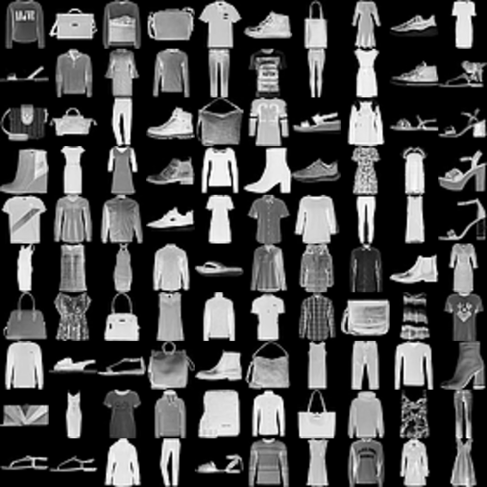

# Fashion-Class-Classification
PROBLEM STATEMENT AND BUSINESS CASE   
Fashion training set consists of 70,000 images divided into 60,000 training and 10,000 testing samples. Dataset sample consists of 28x28 grayscale image, associated with a label from 10 classes.    
The 10 classes are as follows:  
0 => T-shirt/top  1 => Trouser   2 => Pullover   3 => Dress   4 => Coat   5 => Sandal   6 => Shirt   7 => Sneaker   8 => Bag   9 => Ankle boot    
Each image is 28 pixels in height and 28 pixels in width, for a total of 784 pixels in total. Each pixel has a single pixel-value associated with it, indicating the lightness or darkness of that pixel, with higher numbers meaning darker. This pixel-value is an integer between 0 and 255.
 

